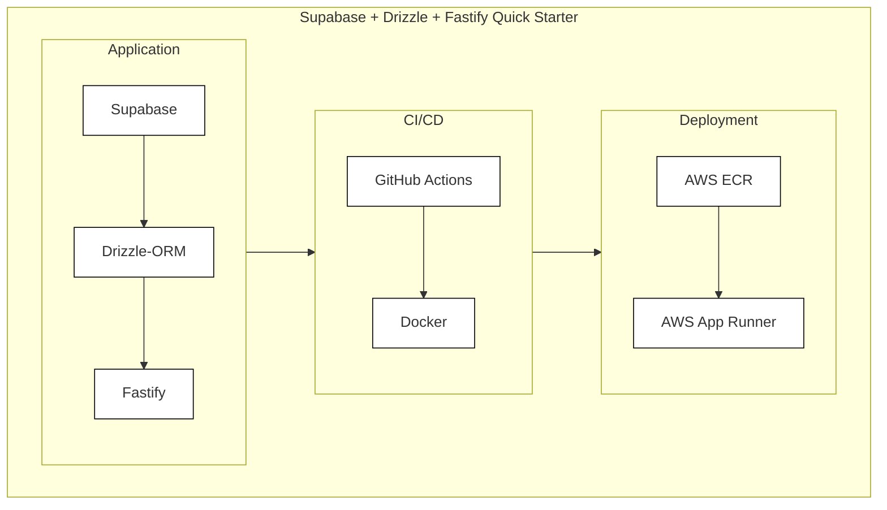
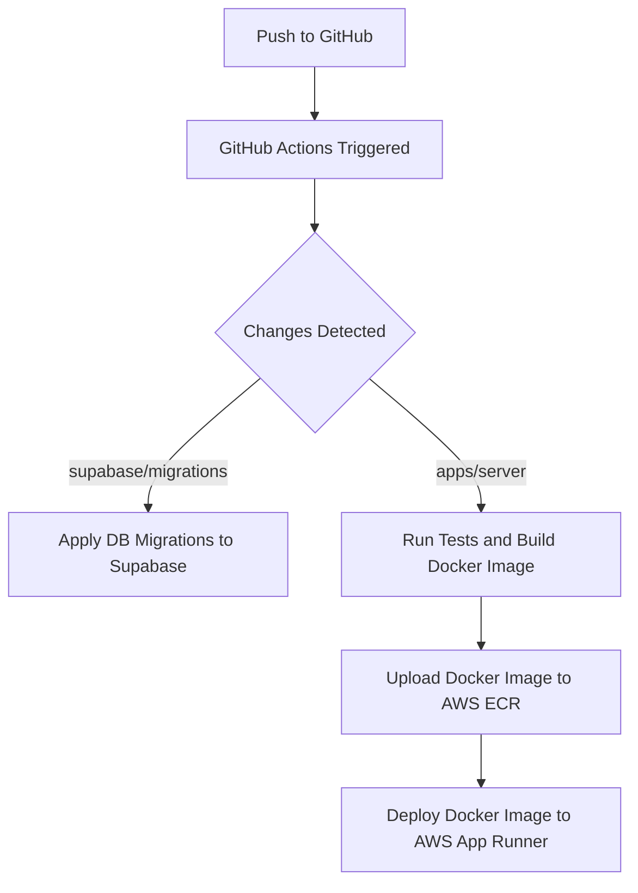

# Supabase + Drizzle + Fastify Quick starter

## Features

- **Supabase** for authentication and database management.
- **Drizzle-ORM** for easy and efficient database operations.
- **Fastify** for a high-performance server.
- **GitHub Actions** for continuous integration and continuous deployment (CI/CD).
- **Docker** for containerization of the application.
- **AWS App Runner** for seamless deployment and scaling.

## Deploy pipeline

- Detect Changes in supabase/migrations: DB migration to supabase database
- Detect Changes in apps/server: Docker build -> Upload to ECR -> Deploy to AWS App Runner

